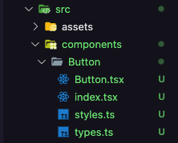
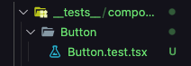
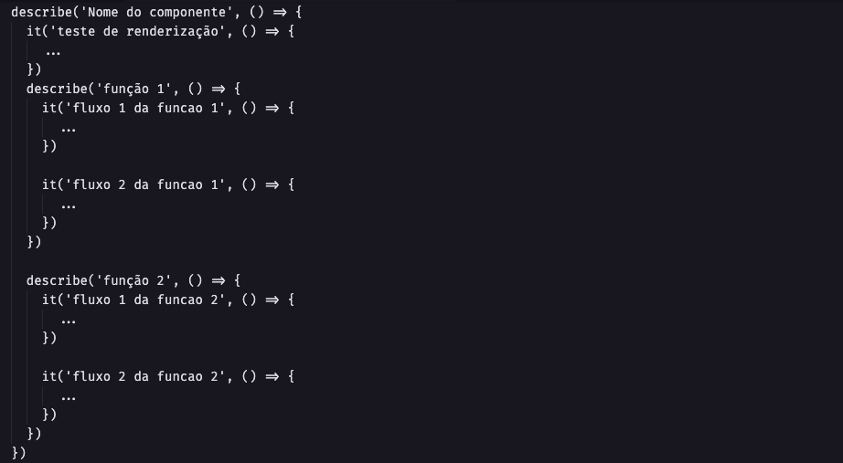
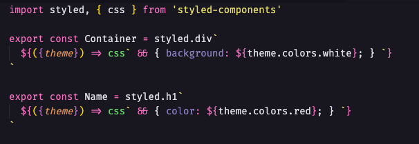
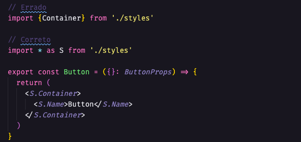
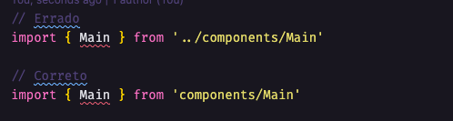
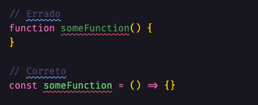
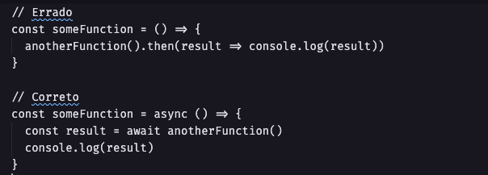

# Regras de Desenvolvimento

## Overview

O Guia do Mochileiro Dev é um blog para compartilharmos nossos aprendizados e também é um projeto open source, ou seja, voce pode contribuir com alguma feature, correção de bug e etc. Como várias pessoas poderam contribuir com o projeto temos a necessidade de criar um padrão de código para ser seguido.

❗️ __Só serão aceitos PR que estiverem seguindo o padrão de código__ ❗️

## Branch

Toda feature, correção de bug, adição de qualquer coisa deve ser criada uma branch nova apartir da __main__, com prefixo de acordo com o que vai ser adicionado. Segue abaixo a lista de prefixo:

### fix/
Serve para branchs de correção de bugs.
### feature/
Serve para branchs de criação de novas features, componentes, páginas e etc.
### hotfix/
Serve para branchs de correção que não sejam bugs, como por exemplo alterar um texto ou uma cor.
### improvement/
Serve para branchs de melhorias de projeto, como aumentar a performance, layout e etc.

## Commit

Seguimos o padrão do conventional commits.

__test:__ indica qualquer tipo de criação ou alteração de códigos de teste. 
__Exemplo:__ Criação de testes unitários.

__feat:__ indica o desenvolvimento de uma nova feature ao projeto. 
__Exemplo:__ Acréscimo de um serviço, funcionalidade, endpoint, etc.

__refactor:__ usado quando houver uma refatoração de código que não tenha qualquer tipo de impacto na lógica/regras de negócio do sistema. 
__Exemplo:__ Mudanças de código após um code review

__style:__ empregado quando há mudanças de formatação e estilo do código que não alteram o sistema de nenhuma forma.
__Exemplo:__ Mudar o style-guide, mudar de convenção lint, arrumar indentações, remover espaços em brancos, remover comentários, etc.

__fix:__ utilizado quando há correção de erros que estão gerando bugs no sistema.
__Exemplo:__ Aplicar tratativa para uma função que não está tendo o comportamento esperado e retornando erro.

__chore:__ indica mudanças no projeto que não afetem o sistema ou arquivos de testes. São mudanças de desenvolvimento.
__Exemplo:__ Mudar regras do eslint, adicionar prettier, adicionar mais extensões de arquivos ao .gitignore

__docs:__ usado quando há mudanças na documentação do projeto.
__Exemplo:__ adicionar informações na documentação da API, mudar o README, etc.

__build:__ utilizada para indicar mudanças que afetam o processo de build do projeto ou dependências externas.
__Exemplo:__ Gulp, adicionar/remover dependências do npm, etc.

__perf:__ indica uma alteração que melhorou a performance do sistema.
__Exemplo:__ alterar ForEach por while, melhorar a query ao banco, etc.

__ci:__ utilizada para mudanças nos arquivos de configuração de CI.
__Exemplo:__ Circle, Travis, BrowserStack, etc.

__revert:__ indica a reverão de um commit anterior.

## Design Pattern

Utilizamos como design pattern o SOLID.
Referência para o uso com [React, TypeScript e SOLID](https://www.slideshare.net/RubenMarcusLuzPascho/escalando-apps-com-react-e-type-script-e-solid)

## Criação de componentes

Todos componentes devem ser criados utilizando o comando `yarn generate`, este comando já cria automáticamente os arquivos necessários.

## Testes

Todos os arquivos devem ser testados com no minímo 90% de coverage. Os testes devem ser separados em fluxos de cada função dentro de um __describe__ específico, exemplo abaixo:

## Nome de arquivos e funções

Arquivos TSX como componentes, páginas deverão ser escritos com a primeira letra maiúscula no padrão PascalCase.
Arquivos de função, hooks, types, index, styles deverão seguir o padrão camelCase, exemplo:

## Style

Todos elementos HTML devem ter um componente criado no __style.ts__ e utilizar o import all aos invés de importar um por um, exemplo: 

## Importação de módulos

Utilizamos os paths absolutos, então não é necessário ficar fazendo '../../.../', exemplo:

## Declaração de funções

Ao declarar funções sempre utilizar const ao invés de __function__, exemplo:

Ao utilizar funções assíncronas sempre utilizar o __await__ ao invés do __.then__, exemplo:

